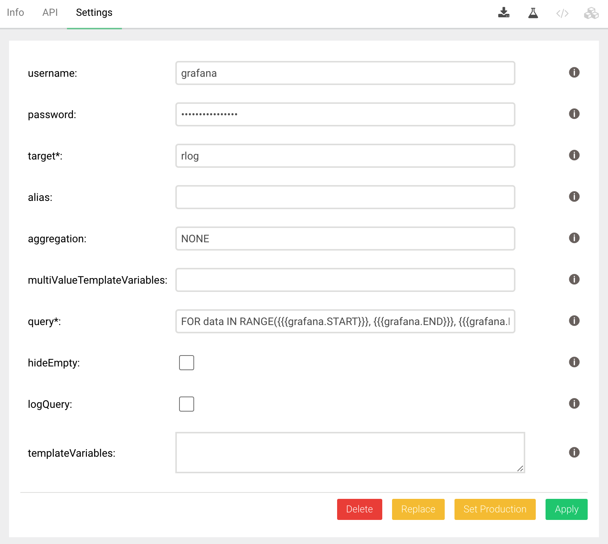

# Grafana Simple JSON connector for ArangoDB

This is the Grafana connector for ArangoDB that can be used as data source for the Grafana plugin
[JSON Data Source](https://grafana.com/grafana/plugins/simpod-json-datasource/). Note that this plugin requires Grafana

8.

## Preparation

First install the JSON Data Source plugin in Grafana following the
[instructions](https://grafana.com/grafana/plugins/simpod-json-datasource/). You may have to restart Grafana for the new
data source to become available.

## Installation

The Grafana connector can be installed as a Foxx service using the
[Foxx CLI](https://github.com/arangodb/foxx-cli):

```sh
$ npm install --global foxx-cli
$ foxx install -u root -P -H http://COORDINATOR:8529 -D _system /grafana \
https://github.com/arangodb-foxx/grafana-connector/archive/master.zip
```

or the
[ArangoDB web interface](https://docs.arangodb.com/latest/Manual/Programs/WebInterface/Services.html):

```sh
$ npx foxx-cli install -u root -P -H http://localhost:8529 -D _system /grafana \
https://github.com/arangodb-foxx/grafana-connector/archive/master.zip
```

## Simple Configuration

Before you can use the ArangoDB connector in Grafana you need to configure the service using the web interface or the
Foxx CLI. There are the following parts that need to be configured.

* ArangoDB grafana-connector
    * a username / password to access the service in ArangoDB
    * the AQL query to extract the timeseries
    * the targets shown in Grafana
* Grafana JSON Data Source
    * the same username / password as above to access ArangoDB. This is a global configuration.
    * per dashboard variables. This step is optional.

The following steps describe a simple configuration without any special targets and/or dashboard variables.

### ArangoDB Configuration

You should have installed the Foxx service as described above. The _Settings_ tab will show the configuration page.



There are two possible configurations for authorization depending on the value of `server.authentication-system-only`.
If `true` then Foxx apps are not authenticated and need to provide their own authentication. In that case you should
define

* username
* password

If `false` then Foxx apps are using the normal authentication, and you should create a read-only user with access to the
database.

In either case you will need the username and password later when configuring the JSON data source in Grafana.

`target` can be any name. It will be shown in Grafana under the Metric selector when defining a query.


Leave `alias` and `multiValueTemplateVariables`, `templateVariables` empty for now.

Define the following dummy query

    FOR data IN RANGE({{{grafana.START}}}, {{{grafana.END}}}, {{{grafana.INTERVAL}}})
        LET doc = {time: data, value: data}

See below for a detailed explanation. Save the configuration.

Assuming that the database is called `rlog` and the mounted the Foxx service at
`rlog2` then you can check using curl

    > curl "http://localhost:8529/_db/rlog/rlog2/" --user username:password
    {
        "ok": true
    }

### Grafana Configuration

To add the connector as a data source in Grafana, navigate to
_Configuration > Date Sources_ and press the _Add data source_ button, then select the _Json_ data source.


Enter the URL of the service, e.g. `http://localhost:8529/_db/rlog/rlog2`, and tick the checkbox for _Basic Auth_, then
enter the credentials you defined while configuring the service.

After pressing _Save & Test_ you should see a `Data source is working` message. If you any other message, for
example `Forbidding` check the values you entered.

Now you can access ArangoDB from within Grafana.

### Simple Dashboard

Create a dashboard and add a panel using the datasource.


You will see a straight line for any time range.

### Query Details

The purpose of the Grafana connector is to allow time series data from ArangoDB to be displayed in Grafana. As ArangoDB
is a multi-model database and not only a time series one, it requires you to provide a query that will produce a time
series when executed. The current query is

    FOR data IN RANGE({{{grafana.START}}}, {{{grafana.END}}}, {{{grafana.INTERVAL}}})
        LET doc = {time: data, value: data}

In general, the query defined should generate a sequence of documents called `doc`
that contain two attribute `time` and `value`. The attribute `time` is a timestamp expressed as milliseconds since
1.1.1970. The attribute `value` must be a number.

Note that the query is not a complete AQl. In the current example a filter and return will automatically be added so
that the final query is

    FOR data IN RANGE(1641643318607, 1641816118607, 120000)
        LET doc = {time: data, value: data}
        FILTER doc.time >= @value0 AND doc.time < @value1
        SORT doc.time
        RETURN [doc.value, doc.time]

### Collection Query

The dummy query only contained static values. Now assume that you have a collection
`data` the contains documents the following type

    {
        "date": 1641643318607,
        "value": 0.7433146809895126
    }

and you want to use this collection as data source. In this case the query looks like

    FOR data IN data
        LET doc = {time: data.date, value: data.value}

This query will augmented and executed as

     FOR data IN data LET doc = {time: data.date, value: data.value}
          FILTER doc.time >= @value0 AND doc.time < @value1
          SORT doc.time
          RETURN [doc.value, doc.time]

### Aggregations

As you can see the query will return all data points within the time range. Sometimes you want to restrict the data
returned and instead return an aggregation. For example, the average.

Go back to ArangoDB configuration and change the _aggregation_ entry from `NONE` to
`AVG`. Now the finally query will be

    FOR data IN data LET doc = {time: data.date, value: data.value}
          FILTER doc.time >= @value0 AND doc.time < @value1
          COLLECT date = FLOOR(doc.time / @value2) * @value2
          AGGREGATE value = AVERAGE(doc.value)
          SORT date
          RETURN [value, date]

### Multiple Aggregations

It is possible to allow the Grafana user to select an aggregation. Instead of just defining a single aggregate, you can
define multiple, comma-seperated values. For example, `NONE,SUM,AVG`.

However, in order to give the user a choice you need to change the target to

    rlog.{{{aggregation}}}

Now the _Metric_ drop-down will now show


Why is that so? The Grafana connector will generate one target per aggregation defined. It also uses Mustache to allow
parameters within defined strings. In this example, the target is defined as `rlog.{{{aggregation}}}`. The part
`{{{aggregation}}}` will be replaced by the current value of the aggregation.

### Using Different Collections

It is also possible to use different collections to use. Assume your data is stored in `data` and another time series
in `rlog`.

If you define the target as

    data,rlog

and your query as

    FOR data IN {{{target}}}
        LET doc = {time: data.date, value: data.value}

### Using Different Collections With Multiple Aggregations

Combining these both feature requires a bit more work because targets will be

    data.{{{aggregation}}},rlog.{{{aggregation}}}

This can no longer be used as collection name. You need to define `alias` as well

    data,rlog

and change the query to

    FOR data IN {{{alias}}}
        LET doc = {time: data.date, value: data.value}

### Grafana Variables

While the above approach let you define the collection to use when setting the query in Grafana, there is also a
different solution. Grafana allows for variables to be defined that the user can select in the dashboard.


The _Custom_ query allows you to specify a number of static values. These can then selected in the dashboard.

Change the `target` to

    {{{aggregation}}}

clear the alias, and define the query

    FOR data IN {{{grafana.collection}}}
        LET doc = {time: data.date, value: data.value}

### Multi-Value Grafana Variables

Change the option for the variable defined above in Grafana to _Multi-value_. This will allow you to select one or more
options. However, if you select both
`data` and `rlog` you will see an error message. This is because you need to configure the variable in ArangoDB as well.
Go to _Settings_ and set
`multiValueTemplateVariables` to

    collection

With this definition the Grafana connector will iterate over all values selected and create a separate response.

### Dynamic Grafana Variables

Instead of hard-coding the different collection names you can also query the Grafana connector.

In the Grafana connector define

    {"collections":"for c in ['data', 'rlog'] return c"}

This will define a template variable query called `collections`.

Go back to variable definitions in Grafana and change it to


This will now use the query defined in the connector to extract the values.

## License

This code is licensed under the
[Apache License, Version 2.0](https://www.apache.org/licenses/LICENSE-2.0).
